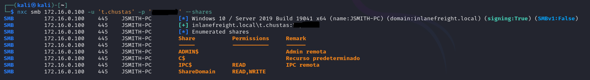
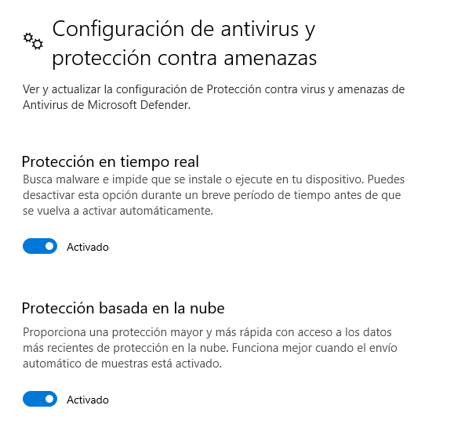
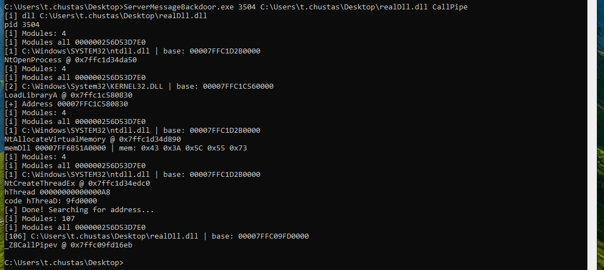
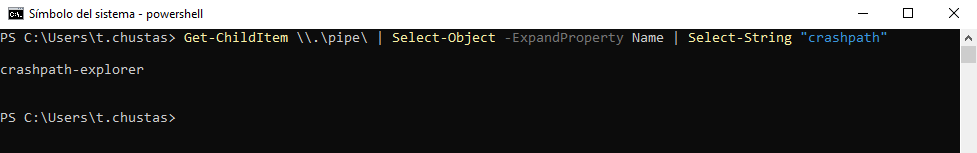
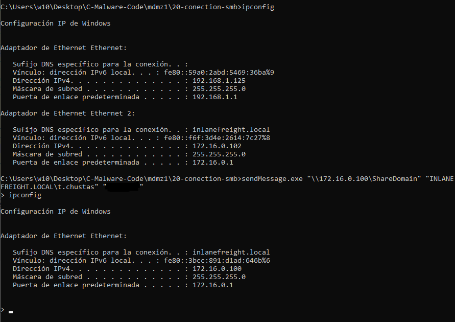
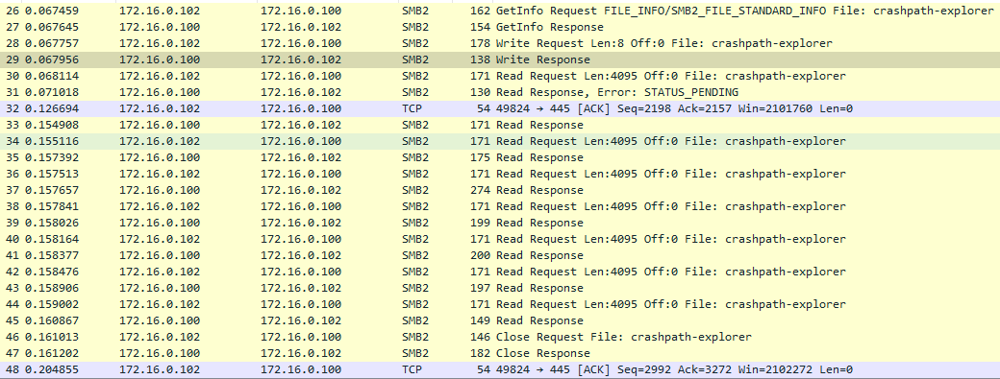
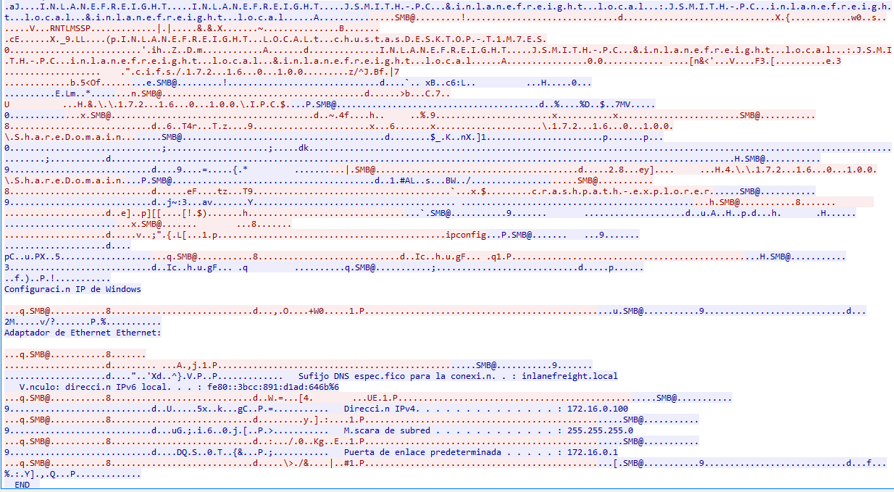

Over the last couple of weeks, I've been messing around with one of the Windows API features that had been sitting on my to-do list for a while, `Named Pipes`. If you don't know what they are, they're basically channels that processes use to exchange information. They work through a file-like interface (kind of like Linux FIFOs) and, best of all, they can even be used to communicate with remote processes!

This might not be anything new to a lot of people. In fact, throughout the history of cybersecurity, plenty of vulnerabilities and exploits have used Named Pipes as a communication channel or even as part of the attack surface.

In my head, all of this sounded way more complicated than it actually is. Then again, it's Windows, so I'm not really sure what I was expecting. A few of the things I learned along the way were:

- Any user can create a Named Pipe.
- A user can connect to a Named Pipe as long as they have the right permissions.
- As I mentioned before, Named Pipes are not limited to local communication, they can also be used remotely.
- Their security model depends on permissions (ACLs).

Now you might be thinking, "Alright, but what does any of this have to do with the title `It's me, Pipe. Don't mind me.`?" Well, if you've made it this far, you've probably noticed that I've put a lot of emphasis on the word `remote`. And that's where things start to get interesting. In the following sections, I'll explain how I managed to combine Named Pipes, SMB, and a process that's been running since you logged in to build a pretty unusual persistence mechanism.

## Why SMB?

It's pretty common for Named Pipes to be exposed through the SMB (Server Message Block) protocol, allowing remote processes to communicate with them transparently. In fact, Windows uses this mechanism internally for a lot of different services, such as transporting RPC calls or handling certain authentication tasks in Active Directory environments.

At this point, you might be wondering: don't they have any kind of protection? Well, that depends on how they're configured. A Named Pipe can have an Access Control List (ACL) that restricts which users or processes are allowed to connect to it. However, if the developer configures a NULL DACL, any user who can reach the pipe will be able to access it.

Besides enabling remote access, SMB also acts as the transport mechanism between the Named Pipe client and server. This allows applications to exchange messages without having to implement their own socket-based protocol, since Windows takes care of the communication for us. From a cybersecurity perspective, this is particularly interesting because it lets us take advantage of infrastructure that Windows already uses legitimately and regularly, instead of having to build our own communication protocol.

## Putting the Pieces Together

As I mentioned before, SMB and Named Pipes often go hand in hand. But on their own, they don't really do anything. A Named Pipe is just a communication channel, if there's nobody listening on the other end, it's little more than an empty pipe.

So, for this whole idea to work, we need to solve three problems:

1. Get someone (or something) to constantly listen for whatever we send through the pipe.
2. Make sure that "someone" stays alive for the entire user session instead of disappearing after a few seconds.
3. Make the whole thing look as harmless as possible to Windows Defender. (Yes, if you were expecting a solution approved and signed off by Microsoft's product team, I don't think you've understood the tone of this article.)

Luckily for us, Windows provides an almost perfect candidate for the job. A process that's present in pretty much every user session, lives as long as the desktop itself, and rarely attracts any attention just for being there.

## Enter Explorer

Have you ever killed the `explorer.exe` process? If the answer is yes, you probably had a small heart attack when your desktop and taskbar suddenly disappeared. But after a little while, there it is again. And that's exactly what makes `explorer.exe` so interesting to us: Windows really likes to keep it alive.

I'm not going to get into how I managed to inject code into a process, because I'd end up spending more time talking about injection than about Named Pipes themselves. Besides, I think that topic deserves its own article.

At a high level, the idea is pretty simple: open the target process, inject a DLL, and execute a function from that DLL in a new thread inside the remote process. The theory is straightforward, the interesting part comes afterwards. Windows Defender and other security mechanisms have spent years keeping an eye on that exact sequence of actions, so getting everything to work reliably is a lot more entertaining than it might sound.

Alright, let's assume we already have our DLL running inside `explorer.exe`. The next question is obvious: what do we actually put in there?

The most obvious answer would be to create a Named Pipe and leave a thread listening forever. And honestly, you wouldn't be too far off. First, we'd need to configure the pipe's security model (in this case, by using a NULL DACL) and then create a loop that waits for connections and processes incoming messages.

Something like this:

```cpp
SECURITY_DESCRIPTOR sd;
SECURITY_ATTRIBUTES sa;

InitializeSecurityDescriptor(&sd, SECURITY_DESCRIPTOR_REVISION);

SetSecurityDescriptorDacl(&sd, TRUE, NULL, FALSE);

sa.nLength = sizeof(sa);
sa.lpSecurityDescriptor = &sd;
sa.bInheritHandle = FALSE;
```

And then use it when creating the Named Pipe:

```cpp
while(true){
	CreateNamedPipeW(L"\\\\.\\pipe\\<MALICIOUS-PIPE>", PIPE_ACCESS_DUPLEX, PIPE_TYPE_MESSAGE | PIPE_READMODE_MESSAGE | PIPE_WAIT, 1, 4096, 4096, 0, &sa);
	[...]
}
```

From that point on, the job is simply to wait for incoming connections and read whatever data arrives. As I mentioned before, Named Pipes are handled through an interface that's very similar to a regular file, so working with them feels pretty natural.

The next step is to capture the output of the process we're going to execute. To do that, we create a temporary anonymous pipe:

```cpp
if (!CreatePipe(&hRead, &hWrite, &sa, 0)) {
	WriteText(hClientPipe, "[-] CreatePipe failed\r\n__END__\r\n");
	return;
}
```

Next, we configure the `STARTUPINFOA` structure to redirect the process's standard output and standard error streams. In my case, the target process is just a simple `cmd.exe`:

```cpp
STARTUPINFOA si;

si.cb = sizeof(si);
si.dwFlags = STARTF_USESTDHANDLES;
si.hStdOutput = hWrite;
si.hStdError = hWrite;
si.hStdInput = GetStdHandle(STD_INPUT_HANDLE);

[...]

CreateProcessA(NULL, cmdline, NULL, NULL, TRUE, CREATE_NO_WINDOW, NULL, NULL, &si, &pi);
```

At this point, all the output generated by the process ends up in our anonymous pipe. The final step is simply to read its contents and forward them to the Named Pipe that's handling communication with the client:

```cpp
while (ReadFile(hRead, buffer, sizeof(buffer), &bytesRead, NULL) && bytesRead > 0) {
	hadOutput = TRUE;
	WriteFile(hClientPipe, buffer, bytesRead, &bytesWritten, NULL);
}
```

And that's where I ran into a small problem: how does the client know when the command has finished producing output? My solution was pretty straightforward. Once all the output has been processed, I simply append a special marker to indicate the end of the transmission:

```cpp
WriteText(hClientPipe, "\r\n__END__\r\n");
```

It's not the most sophisticated protocol in the world, but it gets the job done and makes the client-side logic a lot simpler.

> [!NOTE]
> The actual DLL has quite a bit more going on behind the scenes. I've trimmed out a lot of the code because the goal of this article isn't to publish a full implementation, but to show the idea and demonstrate the potential of Named Pipes when combined with other Windows components.

## It's Me, the Client

I'm not going to spend too much time on the client side, mainly because it's the least interesting part of the whole setup. At the end of the day, the DLL that's listening does all the heavy lifting, the client just has to send commands and collect the responses.

The approach I went with was to keep the connections as short-lived as possible. Instead of maintaining a permanent connection, the client follows a simple sequence of steps:

1. Establish an SMB connection using valid credentials.
2. Connect to the Named Pipe and send the command.
3. Wait for the full response.
4. Close both the Named Pipe connection and the SMB session.

And that's pretty much it. The client doesn't need to maintain any state or do anything particularly fancy, it simply acts as an intermediary that opens a connection, exchanges some data, and disappears until the next request.

## Whose Process Is It Anyway?

There's one pretty interesting detail about this whole setup that we haven't talked about yet. The user connecting to the Named Pipe doesn't have to be the same user that's actually executing the code behind it.

In my case, the DLL is loaded inside `explorer.exe`, which means that any code it executes runs under the security context of the host process. The Named Pipe itself is just a communication mechanism: it receives messages from a client and passes them to the process that's listening on the other end.

This means that one user can authenticate over SMB and connect to the pipe, while the code handling the request continues to run under the context of the process that created it.

In other words, the user talking to the pipe and the user executing the code don't have to be the same. The pipe only carries the data, the execution context is determined by whatever process is listening on the other end.

## The Fun Part

The environment I'm using for these tests is an Active Directory setup with SMB. One of the machines exposes a share called `ShareDomain`, which is the one we'll be focusing on. To give you a better overview of the Windows shares available, here's an `nxc` screenshot showing the full picture:



The attack will be carried out against a fully updated Windows 10 host with Windows Defender enabled.



We run our tool to inject the function into File Explorer:



And we can verify that the Named Pipe has been successfully created:



Now, with the implant running and the pipe in place, we can execute the script to achieve remote command execution. I'm using the same set of credentials as the target machine, but we could just as easily use any other valid credentials, since that's independent of the technique itself.

Below is the execution of the client binary I use to establish the connection. This was done from another machine on the network. As you can see, 172.16.0.102 is the attacker's host, while 172.16.0.100 is the victim machine:



During the execution of the binary, I also captured the network traffic to see what was being used as the transport mechanism. As we can observe, most of the communication goes over SMB2, with some packets even revealing the name of the Named Pipe:



And this is what the traffic looks like if we follow the request stream:



## Now... What?

At this point, a lot of people are probably wondering, "Alright, but what's the point of all this?"

One of the biggest lessons I've learned over the years, from the first time I tried to launch a Meterpreter reverse shell to now, is that understanding how things work is often more valuable than simply throwing tools at a target. In CTFs, we tend to assume that we'll always be able to brute force our way through a problem by running whatever tool gets the job done. Real-world environments are a bit different. Systems are designed to defend themselves, and it's rarely as simple as dropping a `Mimikatz.exe` binary and hoping for the best.

"At this point, the real question isn't where the line is, but how long it'll take before Microsoft suspends my account."
