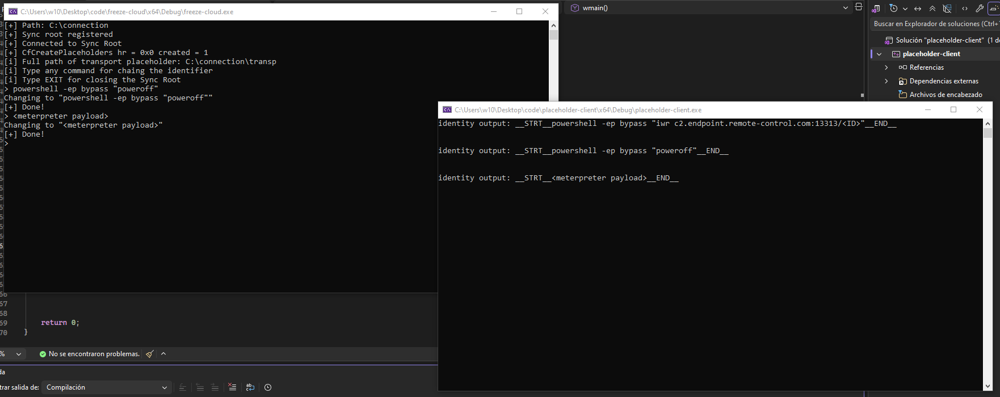
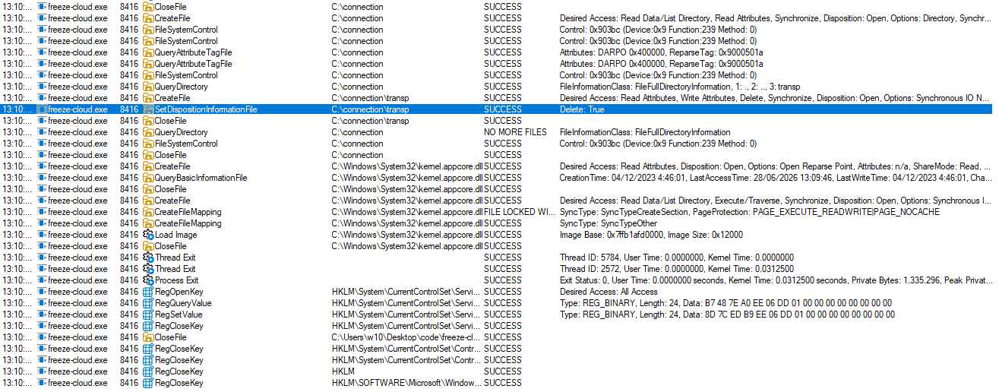
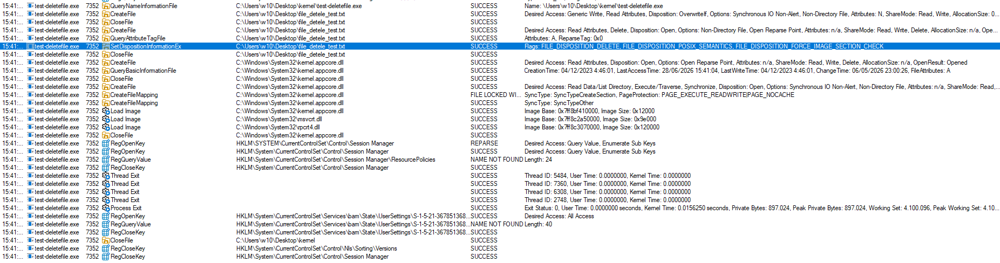

A couple of weeks ago, I started messing around with some of the techniques used by the LPE `BlueHammer`, specifically the Cloud Files-related parts. While my goal isn't to recreate the exploit (mainly because it relies on several other techniques, and reimplementing it from scratch feels completely insane), I was particularly intrigued by everything surrounding the Cloud Files API. I had no idea what I was getting myself into.

Although the API itself isn't particularly large, it's probably one of the least documented APIs I've ever worked with. Every time I tried to find examples, use cases, or simply understand the typical application workflow, I kept ending up in the Microsoft Learn documentation, which, in many cases, explains what a function does but barely goes into how it is actually meant to be used in a real implementation. Overall, it was quite a frustrating experience.

That said, after several hours of reverse engineering, experimentation, and more than a few headaches, I managed to understand how a large part of the Cloud Files ecosystem works. This article documents that journey: from placeholders and hydration to how I eventually built a small proof of concept to explore an unconventional communication channel.

## Hell isn't below, It's stored in the cloud

I'm not going to take you through the entire thought process, the countless experiments, or the endless lines of code I wrote to figure out how all of this works. Mainly because I don't want to put you through the same suffering, and because, to be honest, a large part of the process consisted of small proof-of-concepts aimed at observing how the API behaves: what happens when certain content is dehydrated, how placeholders behave, what happens when paths or buffers are modified, and so on.

That said, if you're curious about the full process, you can find all the code in my [GitHub](https://github.com/PR1N5/InjectionPlaybook) repository, under the `mdmz3` directory. As a small bonus, I've also included a from-scratch implementation of the TOCTOU attack described in [Luca Barile's article](https://lucabarile.github.io/Blog/toctou/index.html).

My goal with this article is much simpler: to explain the concepts that I find most interesting about the Windows Cloud Files API, share some of the things I learned along the way, and finally show a small proof of concept demonstrating how all of this can be used to build an unconventional communication channel between processes.

## Abusing CFAPI for Covert Communications

Starting from the beginning, all the time I spent understanding this API eventually led to building a small communication channel between two processes, avoiding traditional mechanisms such as Named Pipes, sockets, or any other common IPC channel.

The idea is fairly simple: use the metadata associated with placeholders as a medium for exchanging information. At this point, you're probably thinking, "What's so special about that? Hiding information in metadata isn't exactly a new idea". And you'd be right.

The difference lies in which metadata we're using. We're not talking about the classic file attributes (author, comments, ADS, etc.), but rather the metadata that is specific to the Cloud Files infrastructure. This data is managed by the Sync Root provider and is part of the API's normal operation. From the operating system's perspective, accessing it is a completely legitimate operation within the lifecycle of a placeholder.

That's precisely why I found it interesting. Rather than creating a new communication channel, the idea is to reuse one that already exists as part of Windows' synchronization mechanism.

The key to making this work is that every placeholder contains a provider-defined metadata blob known as the `File Identity`. Windows itself treats this field as opaque: it is simply stored and returned back to the synchronization provider whenever necessary. Since the operating system never interprets its contents, it effectively becomes an arbitrary byte buffer controlled entirely by the provider, making it an attractive candidate for exchanging opaque data.

Once the Sync Root has been initialized, the proof of concept is surprisingly small. One process periodically updates the placeholder's `File Identity`, while a second process retrieves the same metadata using `CfGetPlaceholderInfo()`. Since Windows never interprets the contents of the File Identity field, the placeholder effectively becomes a communication channel between both processes.



In the previous image, the process on the left acts as the sender and writes data into the placeholder's metadata. The process on the right, in turn, simply queries that metadata and retrieves the information. There's no particularly complex logic involved. The proof of concept is only intended to demonstrate that the metadata managed by Cloud Files can be repurposed as a communication channel between processes.

The implementation is surprisingly small. The only relevant pieces are shown below (initialization omitted for brevity).

```cpp
HRESULT hr = CfRegisterSyncRoot(SYNC_ROOT, &registration, &policies, CF_REGISTER_FLAG_MARK_IN_SYNC_ON_ROOT);

CF_CALLBACK_REGISTRATION callbacks[] = {
    { CF_CALLBACK_TYPE_FETCH_DATA, FetchDataCallback }, // this callback is just for giving fake output in case someone tries to read the placeholder
    CF_CALLBACK_REGISTRATION_END
};

HRESULT hr = CfConnectSyncRoot(SYNC_ROOT, callbacks, nullptr, CF_CONNECT_FLAG_BLOCK_SELF_IMPLICIT_HYDRATION, &connectionKey);

HRESULT hr = CfCreatePlaceholders(SYNC_ROOT, &placeholder, 1, CF_CREATE_FLAG_STOP_ON_ERROR, &created);

// ....
std::wstring newIdentifier = L"__STRT__" + identifier + L"__END__\r\n";
DWORD newIdentifierSize = static_cast<DWORD>(newIdentifier.size() * sizeof(wchar_t));
USN usn = 0;
HRESULT hr = CfUpdatePlaceholder(h, nullptr, newIdentifier.c_str(), newIdentifierSize, nullptr, 0, CF_UPDATE_FLAG_NONE, &usn, nullptr);


// client
HRESULT hr = CfGetPlaceholderInfo(hFile, CF_PLACEHOLDER_INFO_BASIC, buffer, sizeof(buffer), &returned);
```

>I used `__STRT__` and `__END__` to separate the output from the rest of the metadata, but it wouldn't even be necessary

### Interesting Implementation Details

There's another detail that particularly caught my attention. When a Sync Root is removed, all of its placeholders disappear as well. However, that process doesn't follow the same execution path as a conventional call to `DeleteFileA()`.

Instead, Windows relies on a legacy mechanism within the kernel to delete placeholders, taking a different path from the one followed by most applications when deleting a file. Although the end result is the same, the internal execution flow is different, which I found quite interesting during my research.

The following comparison shows the deletion flow of a placeholder alongside that of a file deleted using `DeleteFileA()`.





If we take a closer look at both execution flows, the difference becomes apparent in the call to `SetDispositionInformationEx`. In the case of placeholders managed through `cfapi.h`, the structure only sets the `Delete` field to `TRUE`, whereas a conventional call to `DeleteFileA()` sets several additional flags, including `FILE_DISPOSITION_DELETE` and `FILE_DISPOSITION_POSIX_SEMANTICS`, among others.

Although both paths ultimately delete the file, the information sent to the kernel and the internal execution path followed by the operation are not exactly the same, making the two cases easy to distinguish when analyzing the execution flow.

## Let's Break It Down

If you've made it this far, you probably want to understand how the Windows Cloud Files API actually works. My goal isn't to explain every function in detail (that's what Microsoft Learn is for), but rather to provide some context around the most important concepts and, above all, explain how they fit together.

Throughout the process, I realized that the official documentation does a fairly good job of describing what each API does individually, but offers very little help when it comes to understanding the overall workflow or how the different pieces relate to one another. That's why, in the following sections, I'll try to explain the concepts as simply as possible, focusing on the parts that I believe are the most relevant to understanding how Cloud Files works under the hood.

### What is a Sync Root?

The `Sync Root` is, essentially, the directory that Windows recognizes as being managed by a synchronization provider. You can think of it as the "entry point" between the operating system and an application such as OneDrive, Dropbox, or any other provider that uses the Cloud Files API.

When an application registers a Sync Root, Windows understands that everything happening within that directory may be controlled by that provider. From that point on, the system can create placeholders, request file hydration, or notify events through callbacks, delegating those operations to the application that registered the Sync Root.

In other words, without a Sync Root, there is no Cloud Files. It is the component that allows Windows to know which application is responsible for managing the files within a given directory.

### Placeholders

A `placeholder` is a special file that represents a real file, but whose contents do not necessarily have to be present on disk. Although it behaves like a regular file from the Windows File Explorer's perspective, internally it only contains the information required for the system to know how to retrieve its contents when they are needed.

This makes it possible to display a file's name, size, timestamps, and metadata without having to store its full contents locally. When an application attempts to access that data, Windows delegates the operation to the provider registered for the Sync Root.

### Hydration

`Hydration` is the process by which a placeholder goes from being merely a representation of a file to containing its actual data. It typically occurs when an application attempts to open or read a file that is not yet available locally.

At that point, Windows generates a request to the Cloud Files provider through a callback. The provider decides how to obtain the data (whether by downloading it, generating it, or retrieving it from any other source) and returns it to the system, which completes the operation as if the file had always been there.

### Callback flow

All communication between Windows and the synchronization provider takes place through `callbacks`. Rather than having the application constantly checking whether an event has occurred, it is the operating system itself that notifies the provider whenever an operation needs to be performed.

For example, if an application attempts to open a placeholder that has not yet been hydrated, Windows generates a callback indicating that the file's contents are required. From that point on, the provider decides how to respond: it can retrieve the data, generate it dynamically, or even reject the operation. In a way, callbacks are the "language" through which Windows and the Sync Root provider communicate.

## Some Fun Facts

While exploring the Cloud Files API, I came across several interesting behaviors that I wasn't expecting to find:

- It is possible to deliberately control which processes are allowed to hydrate a placeholder.
- As a consequence of the above, it is also possible to observe which processes attempt to hydrate a file and react accordingly.
- A hydrated placeholder can later be dehydrated again. However, its behavior is no longer exactly the same as that of a placeholder originally created alongside the Sync Root, as was the case in the previous proof of concept.
- At least during my testing, Windows Defender was unable to hydrate placeholders, even when using `MpCmdRun.exe`.
- If the program exits without unregistering the Sync Root, the path may be left in a broken state, since there is no longer an active provider backing it.
- If a program or file is left dehydrated and the Sync Root is closed, the file may end up in a sort of limbo state, no longer clearly associated with any active provider.

## Final Thoughts

Despite spending far more time on CFAPI than I originally expected, I still feel like I've only scratched the surface. I briefly experimented with junctions (which, if I remember correctly, are also involved in `BlueHammer`), but that's probably a topic for another day, preferably when I feel like questioning my life choices again.

Cloud Files? More like *Jank Files*.
